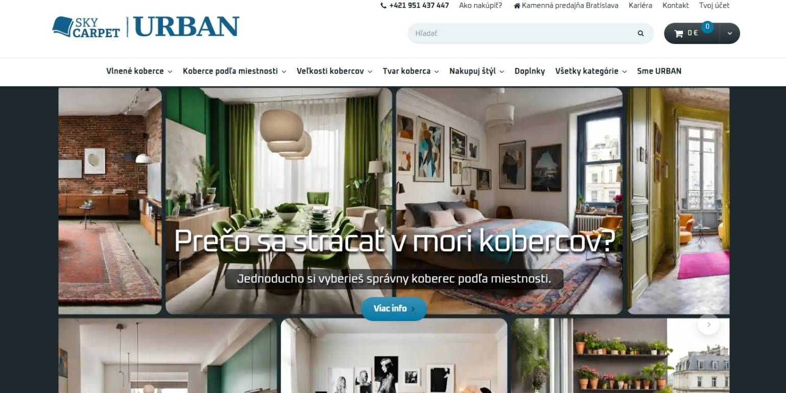
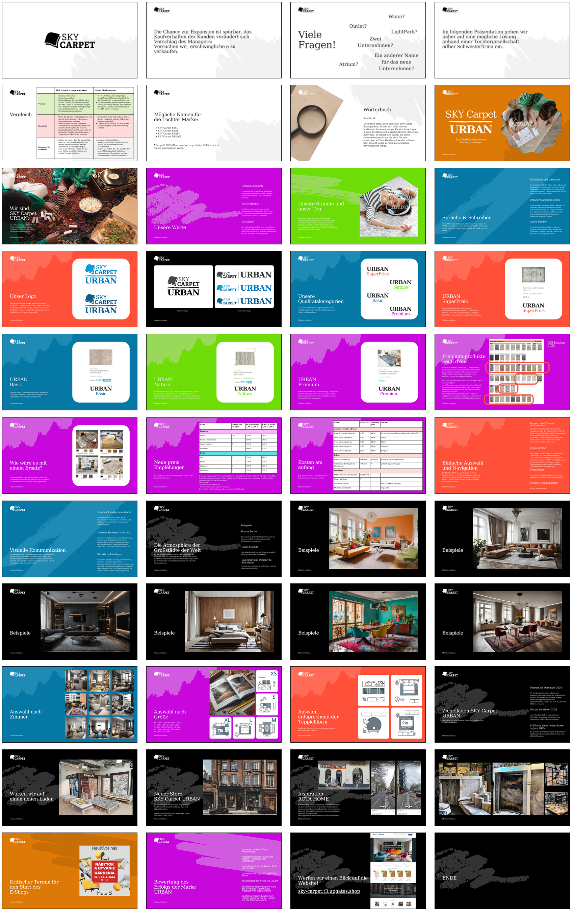
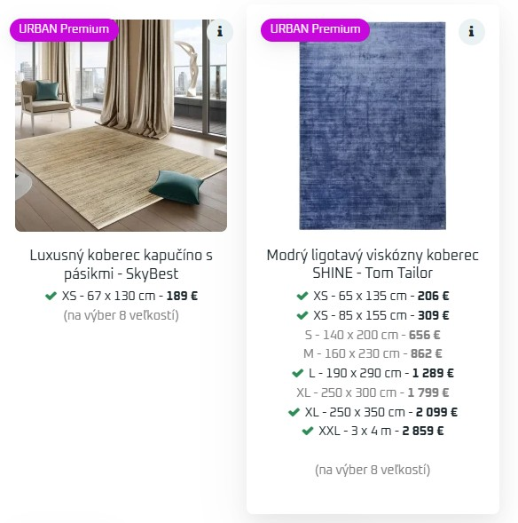
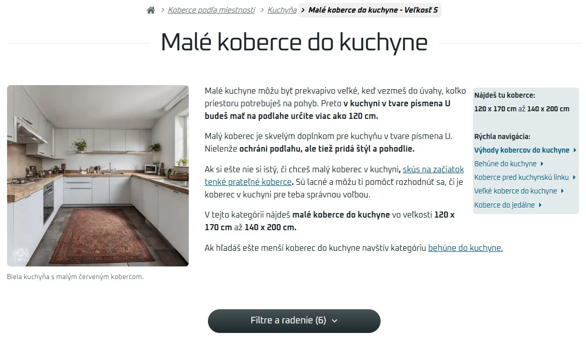
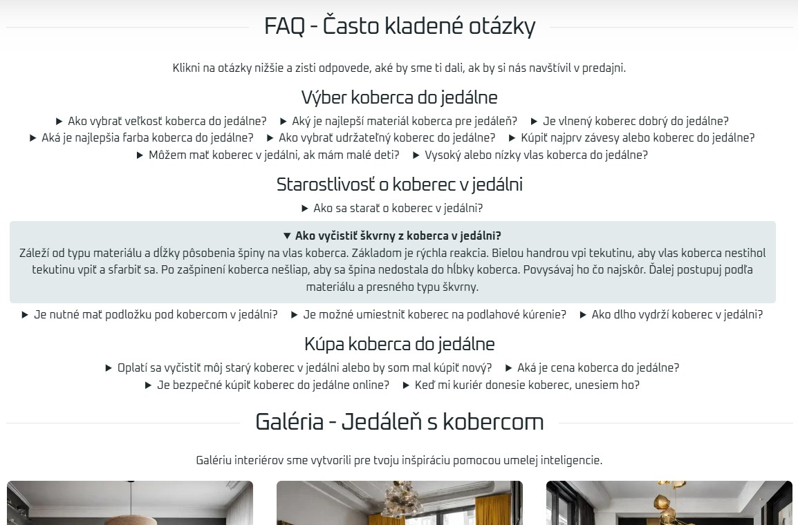

# **SKY Carpet Urban – E‑commerce Launch (Project Owner Case Study)**
### *E‑commerce projekt pre koberce mestského štýlu*

Projekt som viedol end‑to‑end — od definície hodnotovej ponuky a procesnej analýzy až po UX návrhy, technickú implementáciu a marketingové integrácie.

**Project Summary**
- **End‑to‑end e‑commerce projekt** pre mestskú lifestyle značku.
- Ako **Project Owner** som zastrešil **business analýzu, UX návrh, procesný dizajn,**
- **Customizáciu Upgates platformy a marketingové integrácie.**
- Súčasťou projektu bol aj **Python/Django** nástroj pre správu skladových zásob - **2x data pipeline**

**Relevantné BA kompetencie**
- Requirements engineering
- Procesná analýza (AS‑IS / TO‑BE)
- Návrh dátových tokov
- User stories + acceptance criteria
- Prioritizácia (MVP, MoSCoW)
- Stakeholder management
- UX research & prototypovanie

SKY Carpet Urban bol projekt zameraný na vytvorenie moderného e‑commerce riešenia pre predaj **kusových kobercov** pre mladšiu cieľovú skupinu.
Značka bola postavená na **emócii, štýle a identite**, nie na tradičnom „kobercovom“ segmente.
Projekt komunikuje štýl veľkomesta, životný štýl, dynamiku a rôznorodosť.

Ako **Project Owner** som zastrešil návrh, špecifikáciu, UX, procesný dizajn, technickú implementáciu a integrácie potrebné pre spustenie projektu.

---

## 🚀 **Project Overview**

Cieľom projektu bolo vytvoriť:

- moderný e‑shop pre mladú klientelu (25-45) ktorá sa stotožnuje s mestským životným štýlom,  
- vizuálne atraktívnu značku, ktorá predáva emóciu a štýl,  
- jednoduchý a rýchly nákupný proces,  
- platformu pripravenú na marketingové kampane a budúce škálovanie.

Projekt bol postavený na platforme **Upgates**, ktorú som výrazne prispôsobil špecifickým požiadavkám značky.

---

## 👤 **My Role: Project Owner (Business Analysis + UX + Implementation Coordination)**

Moje zodpovednosti zahŕňali:

- **Business analysis & requirements engineering**
- **Preklad biznisových potrieb do technických špecifikácií**
- **Definícia cieľovej skupiny a hodnotovej ponuky**  
- **UX/UI návrhy a prototypovanie**  
- **Kompletná konfigurácia a customizácia Upgates platformy**  
- **Integrácia Google Merchant, Google Analytics, Tag Manager**  
- **Návrh dátového modelu pre produkty a varianty, kompatibilný s platformou Upgates**  
- **Stakeholder management a prezentácie pre vedenie**  
- **Prioritizácia požiadaviek a definícia MVP**  
- **Koordinácia implementácie a testovania**

---

## 🧩 **Key Deliverables**

### 🔹 **1. Business & Product Analysis**
- Definícia cieľovej skupiny (urban, mladá, vizuálne orientovaná)  
- Hodnotová ponuka: „štýl, identita, atmosféra veľkomesta“  
- Návrh dátových tokov medzi systémami  

### 🔹 **2. UX & Brand Design**
- Návrh vizuálnej identity e‑shopu  
- UI návrhy a vizuálne štýly
- Design manual (komentované vzory)
- Návrh kategorizácie produktov – postavený na 3 základných otázkach zákazníka (kam, veľkosť, dizajn)

### 🔹 **3. Technical Implementation**
- Customizácia Upgates šablón pre moderný vizuálny štýl - Uprava tém v Latte 
- Nastavenie produktových feedov - custom xml parser v pythone pre Google Merchant Center
- Integrácia Google Merchant Center + platená reklama 
- Integrácia Google Analytics + Tag Manager  
- Návrh a implementácia manuálneho skladového workflowu (viď nižšie)

---

## 🛠️ Data Pipelines for Product Feeds & Stock Synchronization (Python & Django)##

Cieľom bolo zabezpečiť kvalitné produktové dáta pre marketingové kanály a zároveň minimalizovať náklady na externé integrácie v počiatočnej fáze projektu.
Navrhol som dve samostatné, ale navzájom prepojené dátové pipeline.

### **A. XML Google Merchant Data Pipeline (Python)**

Štandardný Upgates feed neumožňoval exportovať všetky údaje potrebné pre Google Merchant Center.  
Preto som vytvoril vlastnú XML pipeline:

1. **Automatizované získavanie CSV exportov z Upgates**
   - kategórie  
   - produkty + skladové informácie  

2. **Transformácia a mapovanie dát**
   - kombinácia oboch tabuliek v Python skripte  
   - mapovanie na štruktúru Google Merchant feedu  
   - validácia dát  

3. **Automatizované denné spúšťanie**
   - generovanie XML feedu  
   - nahrávanie na FTP pre Google Merchant Center  

---

### **B. Django – Custom Stock Sync Workflow**

V počiatočnej fáze projektu nebol rozpočet na externé skladové integrácie.  
Navrhol som preto **manuálny, ale efektívny a bezplatný workflow**, ktorý:

1. **Získal skladové zásoby od dodávateľov**
   - email → CSV  
   - FTP → CSV  

2. **Spracoval dáta v Django aplikácii**
   - aktualizácia databázy produktov  
   - označenie zmien (delta)  

3. **Generoval Upgates‑kompatibilný CSV export**
   - pripravený na okamžitý import  
   - bez potreby platiť za integráciu  

### **Business Impact**

- Zabezpečenie kvalitných produktových dát pre Google Merchant → vyššia relevancia reklám  
- Eliminácia manuálnej práce pri aktualizácii skladov  
- Úspora nákladov na externé integrácie v early‑stage fáze  
- Flexibilita pri úpravách feedu podľa potrieb značky  
  
---

## 🖼️ **Screenshots & Artefacts**

### 🔹 **1. Stakeholder Presentation (Canva)**

- Brand positioning  
- Cieľová skupina  
- Návrh hodnotovej ponuky  
- UX koncept  
- MVP definícia
  

### 🔹 **2. Screenshots e‑shopu**
www.sky-carpet-urban.sk

- [Domovská stránka](Screenshots-&-Artefacts/homepage.jpeg)
- [Produktové kategórie](Screenshots-&-Artefacts/category.jpeg)
- [Detail produktu](Screenshots-&-Artefacts/product.jpeg)
- Custom úpravy šablón - viď nižšie screenshoty
  
Rozbalovacia informácia o skladovej dostupnosti každej veľkosti koberca - hĺkbová úprava Latte témy + CSS
- Štandardná šablóna toto riešenie nepodporuje
- komplet napísané obslužné mini skripty a podmienky
- UX spracovanie

  
Animovaný štýtok - CSS dúhová zmena borderu
- Jednoduchý vizuálny pútač - UX
  

  
Dynamické rozloženie sekcie - HTML + CSS
- Prispôsobí sa rozlíšeniu zobrazovacieho zariadenia
- Pomoc s navigáciou na stránke
  

  
Custom FAQ - HTML compatibile with schema.org microdata + CSS pre SEO
- SEO kompatibilné vďaka microdata
- Hodnota pre užívateľa

---

## 📚 **What I Learned (Transferable Skills)**

- Ako navrhovať digitálny produkt pre špecifickú cieľovú skupinu  
- Ako premeniť emóciu a brand na funkčný UX  
- Ako komunikovať hodnotu projektu stakeholderom  
- Ako definovať MVP a prioritizovať požiadavky  
- Ako kombinovať BA, UX a technické skilly v jednom projekte  
- Ako navrhovať low‑cost riešenia v early‑stage projektoch  

Projekt mi umožnil spojiť business analýzu, UX a technické myslenie do jedného celku — čo je kombinácia, ktorú chcem ďalej rozvíjať v roli Business Analytika.

## 🌟 **Business Impact (kvalitatívny)**
- Zjednotenie brand identity do moderného vizuálneho štýlu
- Zjednodušenie nákupného procesu pre cieľovú skupinu
- Zavedenie merateľných marketingových nástrojov (Analytics, Merchant)
- Zníženie nákladov na integrácie vďaka vlastnému Python workflowu
- Pripravenosť platformy na budúce kampane a škálovanie

---

## 📝 **Why the Project Ended**

Projekt bol ukončený po zmene majiteľa a zmene strategických priorít.  
Ukončenie nebolo spojené s kvalitou riešenia, ale s reorganizáciou firmy.

## 📜 License

This project is published under the **CC BY-NC-ND 4.0 license**.  
It is intended as a portfolio showcase for job applications.  
You may view and share it for non-commercial, educational or evaluative purposes only.

© Zdenko Siegel, 2026
